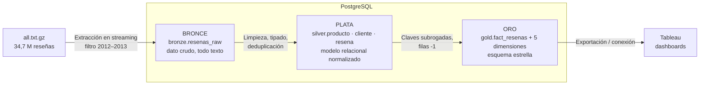

# Data Warehouse de Reseñas de Amazon

Bodega de datos analítica con **topología estrella** construida sobre reseñas reales de productos de Amazon, aplicando la **metodología Kimball** y la **arquitectura Medallion** (Bronce, Plata y Oro) en **PostgreSQL**, con visualización en **Tableau**.

Proyecto académico del curso **Bases de Datos Avanzadas** — Ingeniería de Sistemas, Universidad Popular del Cesar (segundo corte, 2026).

---

## Fuente de datos

| Aspecto | Valor |
|---|---|
| Dataset | Amazon Reviews — SNAP, Universidad de Stanford (McAuley y Leskovec, 2013) |
| Archivo | `all.txt.gz` — 11.699.982.319 bytes (~10,9 GiB comprimido) |
| Formato | Texto plano, bloques `clave: valor` separados por una línea en blanco |
| Registros totales | **34.686.770 reseñas** (verificado), 10 campos por registro |
| Productos / usuarios distintos | 2.441.053 / 6.643.669 |
| Período completo | junio 1995 – 4 de marzo de 2013 |

### Alcance del proyecto

Por tiempo, y con aval del profesor, el proyecto trabaja con **los últimos años del dataset**:

| Recorte | Reseñas |
|---|---|
| 1 ene 2012 – 31 dic 2012 | 3.856.226 |
| 1 ene 2013 – 4 mar 2013 | 1.770.853 |
| **Total del alcance** | **5.627.079** |

El detalle está en [`docs/datos/01_exploracion_bd.md`](docs/datos/01_exploracion_bd.md).

---

## Arquitectura



| Capa | Esquema PostgreSQL | Qué guarda | Regla principal |
|---|---|---|---|
| **Bronce** | `bronze` | Las reseñas del alcance tal como llegan, todas las columnas como texto | Nunca se modifica; si algo falla, se reprocesa desde aquí |
| **Plata** | `silver` | Modelo relacional normalizado (producto, cliente, reseña), limpio y tipado | Aquí se aplican las reglas de calidad del EDA |
| **Oro** | `gold` | Esquema estrella: `fact_resenas` + 5 dimensiones | Única capa que consume Tableau |

---

## Documentación

La documentación está organizada por área. El índice, con el responsable de cada documento, está en [`docs/README.md`](docs/README.md).

| Documento | Contenido |
|---|---|
| [`docs/negocio/00_planteamiento.md`](docs/negocio/00_planteamiento.md) | Introducción, objetivos, requerimientos, KPI/KGI y objetivos a futuro |
| [`docs/datos/01_exploracion_bd.md`](docs/datos/01_exploracion_bd.md) | Resultados de la exploración, alcance, volumetría y reglas del EDA |
| [`docs/datos/perfil_dataset.json`](docs/datos/perfil_dataset.json) | Salida completa del perfilamiento sobre los 34,7 M registros |
| [`docs/modelado/02_modelo_relacional.md`](docs/modelado/02_modelo_relacional.md) | Motor, estructura de tablas y modelo entidad-relación, con la lógica de la normalización |
| [`docs/modelado/03_modelo_estrella.md`](docs/modelado/03_modelo_estrella.md) | Diseño dimensional con Kimball: grano, hechos, 5 dimensiones |
| [`docs/gestion/04_plan_modelo_estrella.md`](docs/gestion/04_plan_modelo_estrella.md) | Plan de la entrega: tema del proyecto y diseño del modelo estrella |
| [`docs/gestion/05_tareas_modelo_estrella.md`](docs/gestion/05_tareas_modelo_estrella.md) | Tareas de la entrega, repartidas entre los dos integrantes |

---

## Estructura del repositorio

```
amazon-ecommerce-data-warehouse/
├── .github/     CODEOWNERS: responsable de cada carpeta
├── bronze/      DDL y carga de la capa Bronce
├── silver/      DDL y reglas de limpieza de la capa Plata
├── gold/        DDL del esquema estrella (y versión para drawSQL)
├── etl/         Scripts de exploración y del pipeline ETL
├── docs/        Documentación por área (índice en docs/README.md)
│   ├── negocio/     Planteamiento, objetivos y requerimientos
│   ├── datos/       Exploración, perfil del dataset y linaje
│   ├── modelado/    Modelo relacional, modelo estrella y diagramas
│   └── gestion/     Plan y tareas de cada entrega
└── dashboard/   Capturas y archivos de Tableau
```

El archivo `all.txt.gz` **no se versiona** (supera el límite de GitHub); cada integrante lo tiene localmente.

---

## Stack

| Herramienta | Uso |
|---|---|
| Python 3.13 (gzip, pandas) | Exploración en streaming y ETL |
| PostgreSQL | Motor de las tres capas (esquemas `bronze`, `silver`, `gold`) |
| Tableau | Dashboards y storytelling |
| drawSQL | Diagrama del modelo estrella |
| Git / GitHub | Control de versiones por ramas y Pull Requests |
| Notion | Plan del proyecto y cronograma de tareas |

---

## Equipo y ramas

| Integrante | Roles | Ramas |
|---|---|---|
| **Dario** | Data Engineer · ETL Developer · PM | `feature/exploracion-bd`, `feature/etl-medallion`, `docs/documentacion`, `dev` |
| **José** | Arquitecto DW · Analista BI | `feature/modelo-dimensional`, `feature/dashboard` |

Flujo: cada rama abre un Pull Request hacia `dev`, el otro integrante lo revisa y antes de cada sustentación `dev` se integra en `main`.
Commits: `feat:` · `docs:` · `fix:` · `data:`

---

## Cronograma del segundo corte

| Fecha | Entrega |
|---|---|
| 29 sep | Presentación inicial: introducción (motor, tablas, MER), objetivos, requerimientos y explicación de la BD ✅ |
| 30 sep | Diseño del modelo estrella |
| 8 oct | Arquitectura Medallion: capas, roles, actividades, herramientas y reglas del EDA |
| 12 oct | Proceso ETL: herramientas y flujo de extracción, transformación y carga |
| 15 oct | Visualización: dashboards interactivos, toma de decisiones y storytelling |
| Final | Documento en PDF con todo el producto |

---

## Cómo reproducir la exploración

```bash
python etl/01_exploracion.py --archivo "C:/Users/<usuario>/Downloads/all.txt.gz" --salida docs/datos/perfil_dataset.json
```

---

Proyecto académico — Bases de Datos Avanzadas, Universidad Popular del Cesar.
