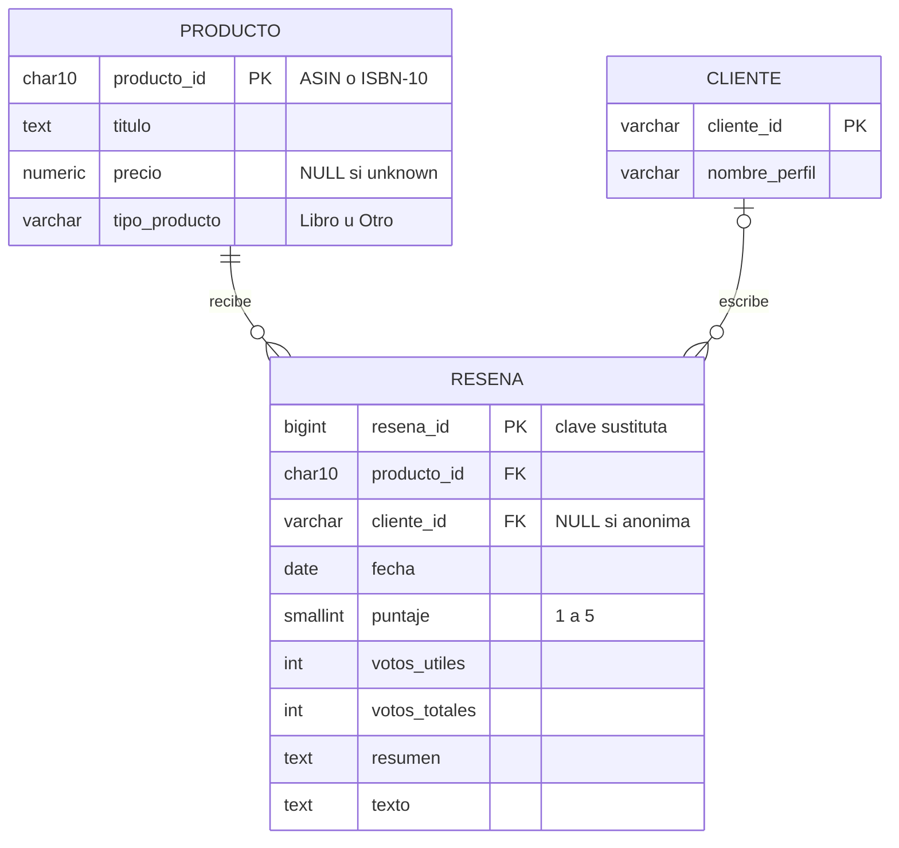

# Motor, estructura de tablas y modelo entidad-relación

Cómo se pasa de un archivo plano sin tablas a un modelo relacional normalizado, y por qué se diseñó así.

---

## 1. Motor de base de datos: PostgreSQL

| Criterio | Por qué PostgreSQL |
|---|---|
| Costo | Libre y de código abierto |
| Volumen | Maneja sin problema los 5,6 M de reseñas del alcance y el crecimiento futuro a 34,7 M |
| Organización por capas | Un **esquema por capa** Medallion: `bronze`, `silver`, `gold` dentro de la misma base |
| Carga masiva | El comando `COPY` carga millones de filas desde CSV mucho más rápido que `INSERT` |
| Integridad | Claves primarias, foráneas, `UNIQUE` y `CHECK` para hacer cumplir las reglas del EDA |
| Visualización | Tableau se conecta a PostgreSQL (con Tableau Public se exporta la capa Oro a CSV) |

---

## 2. Punto de partida: el archivo plano

El archivo trae cada reseña como un bloque de 10 líneas `clave: valor`. Visto como tabla, es **una sola tabla de 10 columnas** con estos problemas:

| Problema | Ejemplo | Consecuencia |
|---|---|---|
| No hay clave primaria | No existe un ID de reseña | No se puede identificar una fila de forma única |
| Valores no atómicos | `review/helpfulness: 2/3` guarda dos números en un campo | No se puede sumar ni promediar |
| Datos repetidos | El título y el precio del producto se repiten en **cada** reseña del producto | En todo el dataset, 32,2 M copias redundantes del mismo título |
| Valores especiales como texto | `"unknown"` en precio y usuario | Mezcla ausencia de dato con datos reales |

La normalización resuelve cada problema en orden.

---

## 3. Normalización paso a paso

### Paso 1 — Primera forma normal (1FN): valores atómicos y clave

**Regla:** cada campo guarda un solo valor y cada fila tiene una clave.

- `review/helpfulness "a/b"` se separa en **`votos_utiles`** y **`votos_totales`**.
- `review/time` (Unix) se convierte en **`fecha`** (`DATE`).
- Como la fuente no trae ID de reseña, se crea una **clave sustituta** `resena_id` (autonumérica).

Resultado: una tabla `RESENA_PLANA(resena_id, producto_id, titulo, precio, cliente_id, nombre_perfil, votos_utiles, votos_totales, puntaje, fecha, resumen, texto)`.

### Paso 2 — Buscar dependencias funcionales (con evidencia)

Una **dependencia funcional** `A → B` significa: si conozco A, conozco B. La exploración lo confirmó con datos:

| Dependencia | Evidencia en la exploración | Conclusión |
|---|---|---|
| `producto_id → titulo, precio` | Pares (producto, título) distintos = **2.441.053** = productos distintos. Igual con (producto, precio) | Cada producto tiene **un solo** título y precio |
| `cliente_id → nombre_perfil` | El nombre de perfil acompaña siempre al mismo userId (se verifica al cargar Plata) | El nombre depende del cliente, no de la reseña |
| `resena_id → todo lo demás` | Puntaje, votos, fecha y texto cambian en cada reseña | Son atributos propios de la reseña |

### Paso 3 — Segunda y tercera forma normal (2FN y 3FN): cada dato en su tabla

**Regla:** un atributo debe depender solo de la clave de su tabla, no de otro atributo.

En `RESENA_PLANA`, `titulo` y `precio` dependen de `producto_id`, no de `resena_id` (dependencia transitiva: `resena_id → producto_id → titulo`). Lo mismo con `nombre_perfil` y `cliente_id`. Por eso se separan:

| Tabla | Clave | Atributos que dependen solo de esa clave |
|---|---|---|
| **PRODUCTO** | `producto_id` | `titulo`, `precio`, `tipo_producto` |
| **CLIENTE** | `cliente_id` | `nombre_perfil` |
| **RESENA** | `resena_id` | `producto_id` (FK), `cliente_id` (FK), `fecha`, `puntaje`, `votos_utiles`, `votos_totales`, `resumen`, `texto` |

El título de un producto ahora se guarda **una vez**, no una vez por reseña.

### Paso 4 — Casos especiales del dato real

| Caso | Decisión | Por qué |
|---|---|---|
| Reseñas anónimas (`userId = "unknown"`, 14,5 %) | `cliente_id = NULL` en RESENA; la relación con CLIENTE es **opcional** | Si se creara un cliente "unknown", sería un falso cliente con millones de reseñas que distorsionaría los conteos por cliente |
| Precio `"unknown"` (62 %) | `precio = NULL` | `NULL` significa "no se sabe"; un 0 sería un precio falso |
| Nombre de perfil que cambia en el tiempo | Se guarda el más reciente | Evita tener dos filas del mismo cliente |
| Libros vs. otros productos | `tipo_producto` derivado del formato del ID (ISBN-10 → "Libro") | Da una clasificación útil sin archivos adicionales |

---

## 4. Modelo entidad-relación

**Cardinalidades:**
- Un **producto** recibe **una o muchas** reseñas; cada reseña es de **exactamente un** producto (1 : N obligatoria).
- Un **cliente** escribe **una o muchas** reseñas; cada reseña tiene **cero o un** cliente (0..1 : N, por las anónimas).

---

## 5. Estructura de tablas por capa

### Bronce — `bronze.resenas_raw` (dato crudo)

Todas las columnas como `TEXT`, tal como vienen del archivo, más columnas de auditoría. No se valida nada aquí: si una regla de Plata falla, se reprocesa desde Bronce sin volver a leer el `.gz`.

| Columna | Tipo | Campo de origen |
|---|---|---|
| `id_carga` | `BIGINT` identidad | — |
| `product_id`, `product_title`, `product_price` | `TEXT` | `product/*` |
| `user_id`, `profile_name` | `TEXT` | `review/userId`, `review/profileName` |
| `helpfulness`, `score`, `review_time` | `TEXT` | `review/helpfulness`, `review/score`, `review/time` |
| `summary`, `review_text` | `TEXT` | `review/summary`, `review/text` |
| `archivo_origen`, `fecha_ingesta` | `TEXT`, `TIMESTAMP` | Auditoría |

### Plata — `silver.producto`, `silver.cliente`, `silver.resena` (normalizado)

Ver el diagrama de la sección 4. Restricciones que hacen cumplir las reglas del EDA:

| Restricción | Regla |
|---|---|
| `CHECK (puntaje BETWEEN 1 AND 5)` | R08 |
| `CHECK (votos_utiles <= votos_totales)` | R07 |
| `UNIQUE (producto_id, cliente_id, fecha)` | R11 |
| `FOREIGN KEY` hacia producto y cliente | Integridad referencial |

### Oro — esquema estrella

Ver [`03_modelo_estrella.md`](03_modelo_estrella.md).

DDL completo: [`bronze/ddl_bronze.sql`](../../bronze/ddl_bronze.sql) · [`silver/ddl_silver.sql`](../../silver/ddl_silver.sql) · [`gold/ddl_gold.sql`](../../gold/ddl_gold.sql)

---

## 6. ¿Por qué normalizar si después se desnormaliza en estrella?

| Capa | Forma | Propósito |
|---|---|---|
| Plata | Normalizada (3FN) | **Una sola versión confiable** de cada producto, cliente y reseña; las restricciones detectan errores al cargar |
| Oro | Desnormalizada (estrella) | **Consultas rápidas** para análisis: pocas uniones entre tablas y atributos listos para filtrar en Tableau |

Las dimensiones de Oro se construyen directamente desde las tablas de Plata, así que la limpieza se hace una sola vez.
