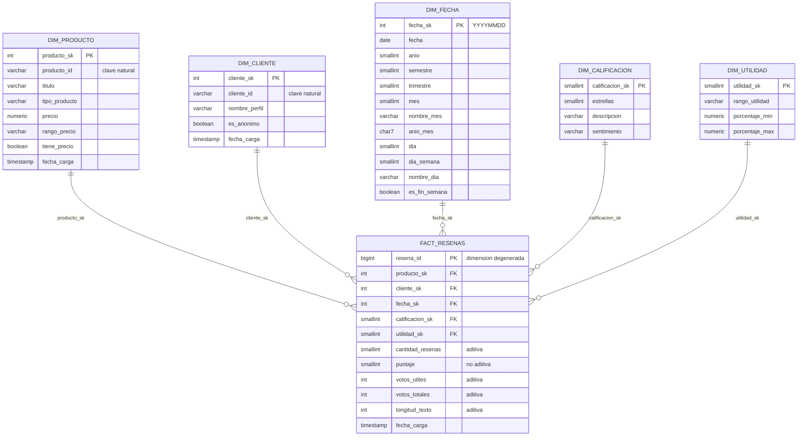

# Modelo estrella — capa Oro

Diseño dimensional con la metodología Kimball. Alcance acotado a **1 tabla de hechos y 5 dimensiones**, todas construidas desde el mismo archivo fuente (sin fuentes adicionales).

DDL: [`gold/ddl_gold.sql`](../../gold/ddl_gold.sql) · Versión para importar en drawSQL: [`gold/drawsql_modelo_estrella.sql`](../../gold/drawsql_modelo_estrella.sql)

---

## 0. Tema y proceso de negocio

- **Área:** experiencia del cliente y reputación de productos.
- **Proceso:** publicación y valoración de reseñas de productos.
- **Título:** *Análisis de la satisfacción del cliente y la reputación de productos de Amazon a partir de sus reseñas (marzo 2010 – marzo 2013).*

### Procesos candidatos

Un proceso de negocio se modela como tabla de hechos solo si la fuente registra **eventos** con **medidas**. Estos son los candidatos y lo que dicen los datos de cada uno:

| Proceso candidato | ¿La fuente lo registra? | Decisión |
|---|---|---|
| Publicación y valoración de reseñas | Sí. Cada registro es una reseña con fecha, producto, cliente, puntaje y votos | **Se elige** |
| Ventas | No. Ningún campo de cantidad, pedido, total ni ingreso | Descartado: no se puede copiar el `FactVentas` de la guía |
| Gestión del catálogo y precios | No es un evento. El precio es un atributo fijo de cada producto (un solo precio por producto) y falta en el 62,1 % del dataset completo | Queda como atributo de `dim_producto` |
| Votación de utilidad como proceso propio | No. Los votos llegan como un acumulado `a/b` dentro de cada reseña, sin fecha ni autor del voto | Los votos son **medidas de la reseña**, no un evento aparte |

Como hay **un solo proceso**, el modelo es **una estrella con una tabla de hechos**, no una constelación.

**Por qué no son ventas.** La fuente no registra ventas: no tiene ningún campo de cantidad, pedido ni ingreso. Sin esos datos no hay un evento de venta que identificar ni números que medir. Por eso el proceso que se modela es el que la fuente sí registra: la publicación y valoración de reseñas.

### Relación con los KGI

El proceso tiene dos momentos, y cada uno alimenta uno de los KGI definidos en [`00_planteamiento.md`](../negocio/00_planteamiento.md) (sección 5):

| Momento del proceso | KGI | Definición | Meta de referencia | Se calcula con |
|---|---|---|---|---|
| El cliente **publica** la reseña y califica de 1 a 5 ★ | Satisfacción del cliente | % de reseñas positivas (4-5 ★) | ≥ 80 % | Reseñas con `sentimiento = 'Positiva'` / `SUM(cantidad_resenas)` |
| La comunidad **valora** la reseña con votos de utilidad | Confianza de la comunidad | % de votos que marcan una reseña como útil | ≥ 70 % | `SUM(votos_utiles) / SUM(votos_totales)` |

Los dos KGI salen de la misma tabla de hechos (`fact_resenas`, una fila por reseña) y usan campos que la fuente sí trae: el puntaje y los votos. Las metas son de referencia y se ajustan al perfilar la historia de 3 años (2010-03-04 a 2013-03-04).

---

## Grano

> Una fila de `fact_resenas` representa una reseña publicada por un cliente (o de forma anónima) sobre un producto en una fecha.

**Quién:** el cliente o un anónimo · **Qué:** el producto · **Cuándo:** la fecha (día).

### Granos considerados

| Grano | ¿Qué permite? | ¿Qué pierde? | Decisión |
|---|---|---|---|
| 1 reseña | Todos los requerimientos | — | **Elegido** |
| Producto × día | Tendencias por producto | Cliente (RQ-08 a RQ-12) y utilidad por reseña (RQ-20) | Descartado |

Se elige el nivel más fino disponible. Desde una reseña se puede subir a producto, cliente o mes sumando; desde un total por producto y día no se puede volver a la reseña.

### Cómo se garantiza que una fila sea una reseña

La fuente no trae un identificador de reseña, así que la unicidad se garantiza en Plata, antes de cargar Oro:

| Regla | Qué elimina | Casos en todo el dataset | Casos en la historia de 3 años |
|---|---|---|---|
| R10 | Registros 100 % idénticos | 86.267 | *Pendiente DB-02* |
| R11 | Repetidos por usuario + producto + fecha (se conserva la primera aparición) | 221.421 | *Pendiente DB-02* |

Cada reseña que queda recibe un `resena_id` en `silver.resena`. Ese identificador pasa al hecho como dimensión degenerada: una fila de `fact_resenas` = un `resena_id`.

**Caso de las anónimas:** no tienen usuario (`cliente_id` es `NULL`), así que R11 no las alcanza. En PostgreSQL, la restricción `UNIQUE (producto_id, cliente_id, fecha)` no considera iguales dos filas con `NULL`. Para ellas solo aplica R10. Dos reseñas anónimas del mismo producto y el mismo día, con texto distinto, se conservan como dos reseñas: pueden ser de dos personas diferentes y no hay forma de saberlo.

### No se mezclan granos

Todas las filas y medidas de `fact_resenas` están al nivel de una reseña. Los totales por mes o por producto no se guardan en este hecho: se calculan en Tableau o, si hicieran falta, irían en otra tabla de agregados. Mezclarlos haría que una misma reseña se contara dos veces al sumar.

---

## 1. Los 4 pasos de Kimball

| Paso | Decisión |
|---|---|
| 1. Proceso de negocio | Publicación de **reseñas** de productos en Amazon |
| 2. Grano | **Una fila = una reseña escrita por un cliente sobre un producto en una fecha** (el nivel más fino disponible) |
| 3. Dimensiones | Producto, Cliente, Fecha, Calificación y Utilidad |
| 4. Hechos | Cantidad de reseñas, puntaje, votos útiles, votos totales y longitud del texto |

---

## 2. Diagrama

---

## 3. Hechos y KPI: `fact_resenas`

### 3.1 Medidas

| Medida | Tipo | Cómo se agrega | Origen |
|---|---|---|---|
| `cantidad_resenas` | **Aditiva** | `SUM` por cualquier dimensión | Constante 1 por fila |
| `puntaje` | **No aditiva: se promedia** | `SUM(puntaje) / SUM(cantidad_resenas)`; sumar estrellas no tiene sentido | `review/score` → `silver.resena.puntaje` |
| `votos_utiles` | **Aditiva** | `SUM` | `review/helpfulness`, la *a* de *a/b* → `silver.resena.votos_utiles` |
| `votos_totales` | **Aditiva** | `SUM` | `review/helpfulness`, la *b* de *a/b* → `silver.resena.votos_totales` |
| `longitud_texto` | **Aditiva** | `SUM`, o promedio con `SUM(longitud_texto) / SUM(cantidad_resenas)` | Largo de `review/text` → `LENGTH(silver.resena.texto)` |

**Semiaditivas:** ninguna. Aparecen en hechos tipo *snapshot* (saldos, inventarios), que se suman entre productos pero no a lo largo del tiempo; este modelo es de tipo *transaccional*.

`resena_id` es una **dimensión degenerada**: el identificador de la reseña vive en el hecho, sin tabla propia, y sirve de linaje hacia `silver.resena`. `fecha_carga` es de auditoría, no es medida.

### 3.2 Fórmulas de KPI y KGI

Cada indicador de [`00_planteamiento.md`](../negocio/00_planteamiento.md) (sección 5) se calcula solo con columnas del modelo:

| Indicador | Tipo | Fórmula con columnas del modelo | Aporta a |
|---|---|---|---|
| Calificación promedio | KPI | `SUM(puntaje) / SUM(cantidad_resenas)` | Satisfacción |
| % reseñas negativas | KPI | `SUM(cantidad_resenas)` con `dim_calificacion.sentimiento = 'Negativa'` / `SUM(cantidad_resenas)` | Satisfacción |
| % de utilidad | KPI | `SUM(votos_utiles) / SUM(votos_totales)` | Confianza |
| % reseñas con votos | KPI | `SUM(cantidad_resenas)` con `votos_totales > 0` / `SUM(cantidad_resenas)` | Confianza |
| Reseñas por mes | KPI | `SUM(cantidad_resenas)` por `dim_fecha.anio_mes` | Actividad |
| % reseñas anónimas | KPI | `SUM(cantidad_resenas)` con `dim_cliente.es_anonimo = TRUE` / `SUM(cantidad_resenas)` | Calidad del dato |
| **Satisfacción del cliente** | KGI | `SUM(cantidad_resenas)` con `dim_calificacion.sentimiento = 'Positiva'` / `SUM(cantidad_resenas)` · meta ≥ 80 % | — |
| **Confianza de la comunidad** | KGI | `SUM(votos_utiles) / SUM(votos_totales)` · meta ≥ 70 % | — |

**Regla de oro: los porcentajes y promedios se calculan al final y nunca se suman.** Primero se suman las partes (numerador y denominador) al nivel que pida el análisis y después se divide. Sumar o promediar porcentajes ya calculados da un resultado falso, porque cada producto o mes pesa distinto. Por eso el hecho no guarda ningún porcentaje.

### 3.3 Nota sobre los votos acumulados

*Pendiente DB-03.* El campo `review/helpfulness` no trae la fecha de cada voto: son los votos acumulados hasta que SNAP recolectó los datos. Si DB-03 confirma que el % de reseñas con votos baja hacia los meses recientes (de 2010 a 2013), las reseñas recientes tuvieron menos tiempo para recibir votos y **comparar la cantidad de votos entre meses no es justo**. En ese caso, la utilidad por mes se analiza con el % de utilidad (proporción), no con `SUM(votos_utiles)`, y se advierte en el dashboard.

---

## 4. Dimensiones

Atributos tomados de [`gold/ddl_gold.sql`](../../gold/ddl_gold.sql), la fuente de verdad. Solo Producto y Cliente vienen de una tabla de Plata; Fecha, Calificación y Utilidad nacen de **atributos de la reseña**.

Todas son **SCD tipo 1**: si un atributo cambia (por ejemplo, el nombre de perfil), se sobrescribe; no se guarda historia. Es suficiente para un análisis histórico cerrado (marzo 2010 – marzo 2013).

### 4.1 `dim_producto`

| Campo | dim_producto |
|---|---|
| Pregunta que responde | ¿Qué producto se reseñó? |
| Requerimientos (matriz de bus) | RQ-01 a RQ-07 |
| Origen | Tabla `silver.producto` (`product/productId`, `product/title`, `product/price`) |
| Atributos | `producto_sk`, `producto_id`, `titulo`, `tipo_producto`, `precio`, `rango_precio`, `tiene_precio`, `fecha_carga` |
| Jerarquía | `tipo_producto` → `producto_id`; `rango_precio` → `precio` |
| Filas | *Pendiente DB-01* (productos distintos de la historia de 3 años) + fila -1 "Desconocido" |
| Tratamiento histórico | SCD tipo 1 |

### 4.2 `dim_cliente`

| Campo | dim_cliente |
|---|---|
| Pregunta que responde | ¿Quién escribió la reseña? |
| Requerimientos (matriz de bus) | RQ-08 a RQ-12 |
| Origen | Tabla `silver.cliente` (`review/userId`, `review/profileName`) |
| Atributos | `cliente_sk`, `cliente_id`, `nombre_perfil`, `es_anonimo`, `fecha_carga` |
| Jerarquía | No tiene: `es_anonimo` → `cliente_id` sirve como agrupación |
| Filas | *Pendiente DB-01* (clientes distintos de la historia de 3 años) + fila -1 "Desconocido" + fila -2 "Anónimo" |
| Tratamiento histórico | SCD tipo 1: se guarda el nombre de perfil más reciente |

### 4.3 `dim_fecha`

| Campo | dim_fecha |
|---|---|
| Pregunta que responde | ¿Cuándo se publicó la reseña? |
| Requerimientos (matriz de bus) | RQ-13 a RQ-16 |
| Origen | Atributo `review/time` → `silver.resena.fecha` (no es una tabla de Plata). El calendario se genera con `generate_series`, no se extrae de la fuente |
| Atributos | `fecha_sk`, `fecha`, `anio`, `semestre`, `trimestre`, `mes`, `nombre_mes`, `anio_mes`, `dia`, `dia_semana`, `nombre_dia`, `es_fin_semana` |
| Jerarquía | `anio` → `semestre` → `trimestre` → `mes` → `fecha`; y `dia_semana` → `es_fin_semana` |
| Filas | 1.461 (años 2010 a 2013 completos) + fila -1 "Desconocida" = 1.462 |
| Tratamiento histórico | Estática: no cambia |

### 4.4 `dim_calificacion`

| Campo | dim_calificacion |
|---|---|
| Pregunta que responde | ¿Qué tan satisfecho quedó el cliente? |
| Requerimientos (matriz de bus) | RQ-01 a RQ-04, RQ-17, RQ-18, RQ-20 |
| Origen | Atributo `review/score` → `silver.resena.puntaje` (no es una tabla de Plata) |
| Atributos | `calificacion_sk`, `estrellas`, `descripcion`, `sentimiento` |
| Jerarquía | `estrellas` → `sentimiento` |
| Filas | 5 + fila -1 "Desconocida" |
| Tratamiento histórico | Estática: no cambia |

### 4.5 `dim_utilidad`

| Campo | dim_utilidad |
|---|---|
| Pregunta que responde | ¿Qué tan útil le pareció la reseña a la comunidad? |
| Requerimientos (matriz de bus) | RQ-10, RQ-19, RQ-20 |
| Origen | Atributo `review/helpfulness` → `silver.resena.votos_utiles` y `votos_totales` (no es una tabla de Plata) |
| Atributos | `utilidad_sk`, `rango_utilidad`, `porcentaje_min`, `porcentaje_max` |
| Jerarquía | `rango_utilidad`: Sin votos (0) / Baja (< 40 %) / Media (40 % a < 70 %) / Alta (≥ 70 %) |
| Filas | 4 + fila -1 "Desconocida" |
| Tratamiento histórico | Estática: no cambia |

---

## 5. Claves subrogadas y filas especiales

- Cada dimensión usa una **clave subrogada** (`*_sk`) generada por la bodega. La clave de la fuente se conserva como atributo (`producto_id`, `cliente_id`) para trazabilidad. Si la fuente cambia sus IDs, el modelo no se rompe.
- `dim_fecha` usa una clave "inteligente" `YYYYMMDD` (práctica aceptada por Kimball para fechas): es legible y ordenable.
- **Ningún hecho tiene claves foráneas nulas.** En el ETL:

| Situación en Plata | Clave en el hecho |
|---|---|
| `cliente_id` NULL (reseña anónima: 14,5 % en el dataset completo; el % de la historia de 3 años sale de DB-01) | `cliente_sk = -2` (Anónimo) |
| Producto, fecha o puntaje sin correspondencia | `-1` (Desconocido) |
| `votos_totales = 0` | `utilidad_sk = 0` (Sin votos) |

Separar **Anónimo (-2)** de **Desconocido (-1)** permite distinguir en Tableau "el cliente decidió no identificarse" de "el dato llegó mal".

---

## 6. Matriz de bus: requerimientos × dimensiones

| Requerimiento | Producto | Cliente | Fecha | Calificación | Utilidad |
|---|:-:|:-:|:-:|:-:|:-:|
| RQ-01 a RQ-04 (desempeño por producto) | ✔ | | | ✔ | |
| RQ-05 Libros vs. otros | ✔ | | | | |
| RQ-06, RQ-07 Precio | ✔ | | | | |
| RQ-08, RQ-09, RQ-12 (comportamiento del cliente) | | ✔ | | | |
| RQ-10 Clientes más útiles | | ✔ | | | ✔ |
| RQ-11 % anónimas | | ✔ | | | |
| RQ-13 a RQ-16 (tiempo) | | | ✔ | | |
| RQ-17, RQ-18 (distribución y sentimiento) | | | | ✔ | |
| RQ-19 % de utilidad | | | | | ✔ |
| RQ-20 Utilidad según calificación | | | | ✔ | ✔ |

Los 20 requerimientos se responden con las 5 dimensiones; ninguna dimensión sobra.

---

## 7. Decisiones de diseño

### 7.1 Decisiones

| Decisión | Qué se decidió | Por qué | Alternativa descartada |
|---|---|---|---|
| **Grano** | 1 fila = 1 reseña | Es lo más detallado que trae la fuente. Con ese nivel se puede analizar por cliente y por reseña (RQ-08 a RQ-12, RQ-20) y subir a cualquier total sumando | Producto × día: se perdería quién escribió y la utilidad de cada reseña |
| **Hechos** | `cantidad_resenas`, `votos_utiles`, `votos_totales`, `longitud_texto` (aditivos); `puntaje` (se promedia) | Se guardan las partes que se pueden sumar; los porcentajes se arman al final, para que den bien a cualquier nivel | Guardar porcentajes ya calculados en el hecho |
| **Dimensiones** | Producto, Cliente, Fecha, Calificación, Utilidad | Las 5 se usan en la matriz de bus y entre todas cubren los 20 requerimientos; ninguna sobra | Categoría, vendedor y ubicación: la fuente no los trae |
| **Claves** | Subrogadas `*_sk`; `fecha_sk` = YYYYMMDD | La bodega no depende de los IDs de Amazon: si cambian, el modelo sigue igual. La de fecha se lee y se ordena sola | Usar `producto_id` o `cliente_id` como FK |
| **Faltantes** | -1 Desconocido; -2 Anónimo; utilidad 0 "Sin votos" | En el dataset completo, el 14,5 % de las reseñas es anónimo y el 32,2 % no tiene votos (las cifras de la historia de 3 años salen de DB-01 y DB-03). Con filas especiales ningún hecho queda sin dimensión y en Tableau se distingue "no quiso identificarse" de "el dato llegó mal" | FK nula en el hecho |
| **Histórico** | SCD tipo 1 | El archivo termina en marzo de 2013 y no va a cambiar; guardar historia (tipo 2) agregaría filas sin ninguna pregunta que lo pida (guía, sección 16) | SCD tipo 2 |
| **Topología** | Estrella | Hay un solo proceso y las dimensiones son pequeñas frente al hecho; menos uniones = dashboards más rápidos | Copo de nieve o constelación |
| **Gold físico** | Tablas con índices en las FK | El hecho tiene unos 9,7 M de filas y Tableau lo consulta todo el tiempo; una vista recalcularía las uniones en cada consulta (guía, sección 20) | Vistas, como en el video |
| **Texto de la reseña** | No entra al hecho, solo `longitud_texto` | Pesaría unos 740 bytes por fila y no se suma ni se filtra; sigue disponible en `silver.resena` | Guardar `resumen` y `texto` en Oro |
| **Calendario** | `dim_fecha` generada con los años 2010 a 2013 completos (1.461 días) | La dimensión no depende de que haya reseñas ese día, y los días sin reseñas también se ven | Sacar las fechas de las reseñas |

### 7.2 Técnicas especiales evaluadas (guía, sección 17)

| Técnica | ¿Se usa? | Motivo |
|---|---|---|
| Dimensión degenerada | **Sí** | `resena_id` vive en el hecho: identifica la reseña y sirve de linaje, pero no tiene atributos propios para una tabla |
| Dimensión de rol (role-playing) | No | Cada reseña tiene una sola fecha (`review/time`); no hay dos fechas que hagan dos roles |
| Junk dimension | No | Ver 7.3 |
| Hecho sin medidas (factless) | No | El evento sí tiene medidas: puntaje, votos y longitud |
| Bridge | No | No hay relaciones M:N dentro de una dimensión en el alcance actual (por ejemplo, un producto con varias categorías) |

### 7.3 Calificación y Utilidad: separadas, no *junk dimension*

Se mantienen como **dos dimensiones separadas**. Unirlas daría una tabla de unas 30 combinaciones sin significado propio, mientras que separadas responden preguntas distintas (satisfacción frente a confianza) y en Tableau cada una es un filtro claro y directo.

---

## 8. Cómo abrirlo en drawSQL

1. Crear un diagrama nuevo en drawsql.app con base de datos **PostgreSQL**.
2. Menú **Import → SQL** y pegar el contenido de `gold/drawsql_modelo_estrella.sql`.
3. Ubicar `fact_resenas` al centro y las 5 dimensiones alrededor.

El archivo para drawSQL no incluye esquemas ni `INSERT` (drawSQL solo dibuja la estructura). El DDL ejecutable es `gold/ddl_gold.sql`.
