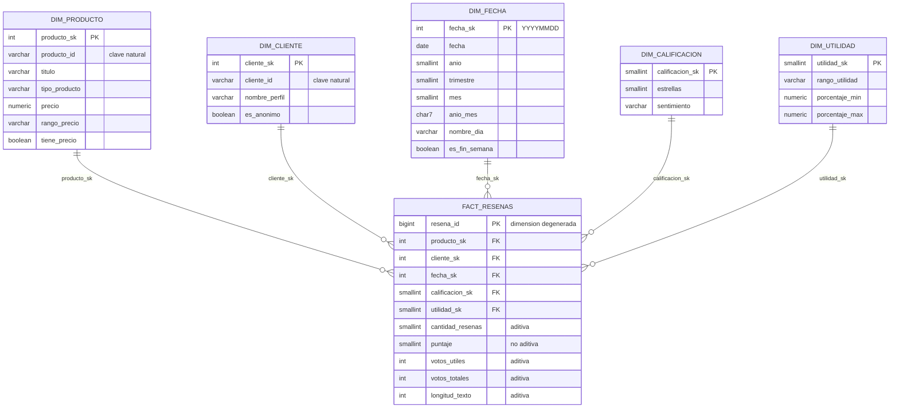

# Modelo estrella — capa Oro

Diseño dimensional con la metodología Kimball. Alcance acotado a **1 tabla de hechos y 5 dimensiones**, todas construidas desde el mismo archivo fuente (sin fuentes adicionales).

DDL: [`gold/ddl_gold.sql`](../../gold/ddl_gold.sql) · Versión para importar en drawSQL: [`gold/drawsql_modelo_estrella.sql`](../../gold/drawsql_modelo_estrella.sql)

---

## 0. Tema y proceso de negocio

- **Área:** experiencia del cliente y reputación de productos.
- **Proceso:** publicación y valoración de reseñas de productos.
- **Título:** *Análisis de la satisfacción del cliente y la reputación de productos de Amazon a partir de sus reseñas (enero 2012 – marzo 2013).*

### Procesos candidatos

Un proceso de negocio se modela como tabla de hechos solo si la fuente registra **eventos** con **medidas**. Estos son los candidatos y lo que dicen los datos de cada uno:

| Proceso candidato | ¿La fuente lo registra? | Decisión |
|---|---|---|
| Publicación y valoración de reseñas | Sí. Cada registro es una reseña con fecha, producto, cliente, puntaje y votos | **Se elige** |
| Ventas | No. Ningún campo de cantidad, pedido, total ni ingreso | Descartado: no se puede copiar el `FactVentas` de la guía |
| Gestión del catálogo y precios | No es un evento. El precio es un atributo fijo de cada producto (un solo precio por producto) y falta en el 62,1 % | Queda como atributo de `dim_producto` |
| Votación de utilidad como proceso propio | No. Los votos llegan como un acumulado `a/b` dentro de cada reseña, sin fecha ni autor del voto | Los votos son **medidas de la reseña**, no un evento aparte |

Como hay **un solo proceso**, el modelo es **una estrella con una tabla de hechos**, no una constelación.

**Por qué no son ventas.** La fuente no registra ventas: no tiene ningún campo de cantidad, pedido ni ingreso. Sin esos datos no hay un evento de venta que identificar ni números que medir. Por eso el proceso que se modela es el que la fuente sí registra: la publicación y valoración de reseñas.

### Relación con los KGI

El proceso tiene dos momentos, y cada uno alimenta uno de los KGI definidos en [`00_planteamiento.md`](../negocio/00_planteamiento.md) (sección 5):

| Momento del proceso | KGI | Definición | Meta de referencia | Se calcula con |
|---|---|---|---|---|
| El cliente **publica** la reseña y califica de 1 a 5 ★ | Satisfacción del cliente | % de reseñas positivas (4-5 ★) | ≥ 80 % | Reseñas con `sentimiento = 'Positiva'` / `SUM(cantidad_resenas)` |
| La comunidad **valora** la reseña con votos de utilidad | Confianza de la comunidad | % de votos que marcan una reseña como útil | ≥ 70 % | `SUM(votos_utiles) / SUM(votos_totales)` |

Los dos KGI salen de la misma tabla de hechos (`fact_resenas`, una fila por reseña) y usan campos que la fuente sí trae: el puntaje y los votos. Las metas son de referencia y se ajustan al perfilar el recorte 2012–2013.

---

## Grano

> Una fila de `fact_resenas` representa una reseña publicada por un cliente (o de forma anónima) sobre un producto en una fecha.

**Quién:** el cliente o un anónimo · **Qué:** el producto · **Cuándo:** la fecha (día).

### Granos considerados

| Grano | ¿Qué permite? | ¿Qué pierde? | Decisión |
|---|---|---|---|
| 1 reseña | Todos los requerimientos | — | **Elegido** |
| Producto × día | Tendencias por producto | Cliente (RQ-08 a RQ-12) y utilidad por reseña (RQ-20) | Descartado |

Se elige el nivel más fino disponible. Desde una reseña se puede subir a producto, cliente o mes sumando; desde un total por producto y día no se puede volver a la reseña.

### Cómo se garantiza que una fila sea una reseña

La fuente no trae un identificador de reseña, así que la unicidad se garantiza en Plata, antes de cargar Oro:

| Regla | Qué elimina | Casos en todo el dataset |
|---|---|---|
| R10 | Registros 100 % idénticos | 86.267 |
| R11 | Repetidos por usuario + producto + fecha (se conserva la primera aparición) | 221.421 |

Cada reseña que queda recibe un `resena_id` en `silver.resena`. Ese identificador pasa al hecho como dimensión degenerada: una fila de `fact_resenas` = un `resena_id`.

**Caso de las anónimas:** no tienen usuario (`cliente_id` es `NULL`), así que R11 no las alcanza. En PostgreSQL, la restricción `UNIQUE (producto_id, cliente_id, fecha)` no considera iguales dos filas con `NULL`. Para ellas solo aplica R10. Dos reseñas anónimas del mismo producto y el mismo día, con texto distinto, se conservan como dos reseñas: pueden ser de dos personas diferentes y no hay forma de saberlo.

### No se mezclan granos

Todas las filas y medidas de `fact_resenas` están al nivel de una reseña. Los totales por mes o por producto no se guardan en este hecho: se calculan en Tableau o, si hicieran falta, irían en otra tabla de agregados. Mezclarlos haría que una misma reseña se contara dos veces al sumar.

---

## 1. Los 4 pasos de Kimball

| Paso | Decisión |
|---|---|
| 1. Proceso de negocio | Publicación de **reseñas** de productos en Amazon |
| 2. Grano | **Una fila = una reseña escrita por un cliente sobre un producto en una fecha** (el nivel más fino disponible) |
| 3. Dimensiones | Producto, Cliente, Fecha, Calificación y Utilidad |
| 4. Hechos | Cantidad de reseñas, puntaje, votos útiles, votos totales y longitud del texto |

---

## 2. Diagrama

---

## 3. Tabla de hechos: `fact_resenas`

| Columna | Tipo de métrica | Cómo se agrega | Origen |
|---|---|---|---|
| `cantidad_resenas` | **Aditiva** | `SUM` por cualquier dimensión | Constante 1 por fila |
| `votos_utiles` | **Aditiva** | `SUM` | `review/helpfulness` (a de a/b) |
| `votos_totales` | **Aditiva** | `SUM` | `review/helpfulness` (b de a/b) |
| `longitud_texto` | **Aditiva** | `SUM` (y promedio con `cantidad_resenas`) | Largo de `review/text` |
| `puntaje` | **No aditiva** | `AVG`; sumar estrellas no tiene sentido | `review/score` |
| % de utilidad | **No aditiva (derivada)** | `SUM(votos_utiles) / SUM(votos_totales)`, calculada en Tableau | — |

**Semiaditivas:** ninguna. Aparecen en hechos tipo *snapshot* (saldos, inventarios), que se suman entre productos pero no a lo largo del tiempo; este modelo es de tipo *transaccional*.

`resena_id` es una **dimensión degenerada**: el identificador de la reseña vive en el hecho, sin tabla propia, y sirve de linaje hacia `silver.resena`.

---

## 4. Dimensiones

| Dimensión | Filas esperadas | Atributos para filtrar | Filas especiales |
|---|---|---|---|
| `dim_producto` | Productos del recorte (≤ 2,44 M) | `tipo_producto` (Libro / Otro), `rango_precio`, `tiene_precio` | -1 Desconocido |
| `dim_cliente` | Clientes identificados del recorte (≤ 6,64 M) | `es_anonimo` | -1 Desconocido · **-2 Anónimo** |
| `dim_fecha` | 731 días (2012–2013, generados) | año, trimestre, mes, `anio_mes`, día de la semana, fin de semana | -1 Desconocida |
| `dim_calificacion` | 5 | estrellas, `sentimiento` (Negativa 1-2 / Neutral 3 / Positiva 4-5) | -1 Desconocida |
| `dim_utilidad` | 4 | `rango_utilidad`: Sin votos / Baja (< 40 %) / Media (40-70 %) / Alta (≥ 70 %) | -1 Desconocida |

Todas son **SCD tipo 1**: si un atributo cambia (por ejemplo, el nombre de perfil), se sobrescribe; no se guarda historia. Es suficiente para un análisis histórico cerrado (2012–2013).

---

## 5. Claves subrogadas y filas especiales

- Cada dimensión usa una **clave subrogada** (`*_sk`) generada por la bodega. La clave de la fuente se conserva como atributo (`producto_id`, `cliente_id`) para trazabilidad. Si la fuente cambia sus IDs, el modelo no se rompe.
- `dim_fecha` usa una clave "inteligente" `YYYYMMDD` (práctica aceptada por Kimball para fechas): es legible y ordenable.
- **Ningún hecho tiene claves foráneas nulas.** En el ETL:

| Situación en Plata | Clave en el hecho |
|---|---|
| `cliente_id` NULL (reseña anónima, 14,5 % en el dataset) | `cliente_sk = -2` (Anónimo) |
| Producto, fecha o puntaje sin correspondencia | `-1` (Desconocido) |
| `votos_totales = 0` | `utilidad_sk = 0` (Sin votos) |

Separar **Anónimo (-2)** de **Desconocido (-1)** permite distinguir en Tableau "el cliente decidió no identificarse" de "el dato llegó mal".

---

## 6. Matriz de bus: requerimientos × dimensiones

| Requerimiento | Producto | Cliente | Fecha | Calificación | Utilidad |
|---|:-:|:-:|:-:|:-:|:-:|
| RQ-01 a RQ-04 (desempeño por producto) | ✔ | | | ✔ | |
| RQ-05 Libros vs. otros | ✔ | | | | |
| RQ-06, RQ-07 Precio | ✔ | | | | |
| RQ-08, RQ-09, RQ-12 (comportamiento del cliente) | | ✔ | | | |
| RQ-10 Clientes más útiles | | ✔ | | | ✔ |
| RQ-11 % anónimas | | ✔ | | | |
| RQ-13 a RQ-16 (tiempo) | | | ✔ | | |
| RQ-17, RQ-18 (distribución y sentimiento) | | | | ✔ | |
| RQ-19 % de utilidad | | | | | ✔ |
| RQ-20 Utilidad según calificación | | | | ✔ | ✔ |

Los 20 requerimientos se responden con las 5 dimensiones; ninguna dimensión sobra.

---

## 7. Decisiones de diseño

| Decisión | Motivo |
|---|---|
| Estrella y no copo de nieve | Menos uniones al consultar, que se traduce en dashboards más rápidos; las dimensiones son pequeñas frente al hecho |
| El texto de la reseña no va al hecho | Pesaría ~740 bytes por fila y no se agrega; queda en `silver.resena` y el hecho guarda solo `longitud_texto` |
| `dim_calificacion` y `dim_utilidad` como dimensiones propias | Convierten números en categorías legibles para filtrar en Tableau (sentimiento, rango de utilidad) |
| Sin dimensión de categoría | El archivo no la trae; incorporarla con `categories.txt.gz` queda como objetivo futuro. `tipo_producto` cubre la separación Libro / Otro |
| Calendario generado 2012–2013 completo | La dimensión fecha no depende de que haya reseñas ese día |

---

## 8. Cómo abrirlo en drawSQL

1. Crear un diagrama nuevo en drawsql.app con base de datos **PostgreSQL**.
2. Menú **Import → SQL** y pegar el contenido de `gold/drawsql_modelo_estrella.sql`.
3. Ubicar `fact_resenas` al centro y las 5 dimensiones alrededor.

El archivo para drawSQL no incluye esquemas ni `INSERT` (drawSQL solo dibuja la estructura). El DDL ejecutable es `gold/ddl_gold.sql`.
